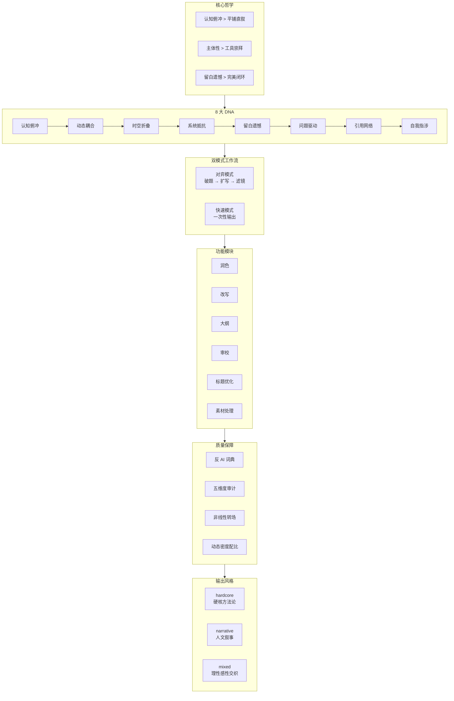

# sspai-writer

一个基于 [少数派](https://sspai.com) 风格的 Claude Code 写作 Skill，经过 87 篇优质文章训练，用于撰写、润色、改写和审校技术博客与公众号文章。

## 核心哲学

| 原则 | 含义 | 反面 |
|------|------|------|
| **认知俯冲** | 拒绝"是什么"，直击"为什么" | 平铺直叙、背景板垫场 |
| **主体性 > 工具** | 工具不是目的，掌控感才是 | 盲目崇拜工具、说明书式写作 |
| **留白与遗憾** | 不圆满才是真理 | 完美闭环、廉价鸡汤 |

## 8 大 DNA

```
认知俯冲 ──────┐
动态耦合 ──────┤
时空折叠 ──────┤  核心引擎
系统性抵抗 ────┤
留白遗憾 ──────┘
     │
问题驱动 ──────┐
引用网络 ──────┤  结构引擎
自我指涉 ──────┘
```

1. **认知俯冲**：以元问题开篇，全文围绕回答核心问题展开
2. **动态耦合**：逻辑与体感根据风格动态配比（hardcore 理性 60-70%，narrative 体感 60-70%）
3. **时空折叠**：纵向对比制造张力，将过去与当下折叠在同一段落
4. **系统性抵抗**：通过优化"小系统"对抗"大混乱"，赋予读者掌控感
5. **留白与遗憾**：开放式结尾，承认局限与未解
6. **问题驱动**：以核心问题贯穿全文，拒绝信息堆砌
7. **引用网络**：具体人名、研究、数据支撑，拒绝"有人说"
8. **自我指涉**：暴露写作过程与困惑，让读者看到"人"而非"输出"

## 架构



> 可编辑版本：[sspai-writer-architecture.excalidraw](sspai-writer-architecture.excalidraw)（导入 [excalidraw.com](https://excalidraw.com) 即可编辑）

## 安装

将本仓库 `skill/` 目录下的内容复制到 Claude Code 全局 Skill 目录：

```bash
# macOS/Linux
cp -r skill/* ~/.claude/skills/sspai-writer/
```

或者直接在 Claude Code 项目根目录创建 `.claude/skills/sspai-writer/` 使用项目级 Skill。

## 使用

在 Claude Code 对话中输入：

```
/sspai-writer
```

或在写作相关场景中自动触发（关键词：写文章、润色、改写、公众号、少数派等）。

### 功能一览

| 功能 | 触发方式 | 说明 |
|------|---------|------|
| 润色 | "润色这段文字" | 消除 AI 味，提升活人感 |
| 改写 | "改写成口语化/硬核风格" | 调整语气、长度、风格 |
| 大纲 | "帮我写个大纲" | 生成三级结构，按风格适配模板 |
| 审校 | "审校这篇文章" | 五维度诊断，不改原文 |
| 标题 | "优化标题" | 生成 5 种风格候选标题 |
| 素材 | "处理这个链接" | 提取核心论断与关联建议 |

### 风格参数

- `--style=hardcore`：结构化、数据驱动、冷峻精密
- `--style=narrative`：段落留白、电影镜头感、体感优先
- `--style=mixed`（默认）：理性与感性交织，最通用

## 文件结构

```
skill/
├── SKILL.md                    # 主协议：触发条件 + 工作流 + 工具路由
└── references/
    ├── writing_dna.md          # 8 大 DNA 字典
    ├── linguistic_patterns.md  # 语言模式库（转场、密度、节奏）
    ├── anti_ai_dictionary.md   # 反 AI 词典（黑名单、耻辱柱、禁区）
    ├── quality_benchmarks.md   # 五维度质量审计表
    ├── personal_dna.md         # 个人创作 DNA（用户画像）
    ├── styles.md               # 三种风格滤镜定义
    ├── tool_mapping.md         # Claude Code 工具路由映射
    └── golden_examples.md      # 8 篇范文精华片段
```

## 质量审计

每轮输出后自动附评分表：

| 维度 | 权重 | 判定标准 |
|------|------|---------|
| 认知张力 | 40% | 是否提出元问题？是否挑战预期？ |
| 颗粒度密度 | - | 每 500 字是否有 2+ 具体物件/数据？ |
| 理感耦合度 | - | 论证后是否紧跟体感细节？ |
| 时空对比度 | - | 是否引入纵向时间轴？ |
| 去 AI 化 | - | 是否避开耻辱柱词汇和句式？ |

## 参考与致谢

- **核心语料**：82 篇少数派年度征文优质文章
- **标杆文章**：《我们用什么语言思考？》（用户特别认可）
- **方法论来源**：YouMind 官方 Write Skill（工具路由）、文案写作元提示词库（工作流框架）
- **前身**：Gemini CLI `public-writer` Skill（基于 87 篇语料训练）

## License

MIT
